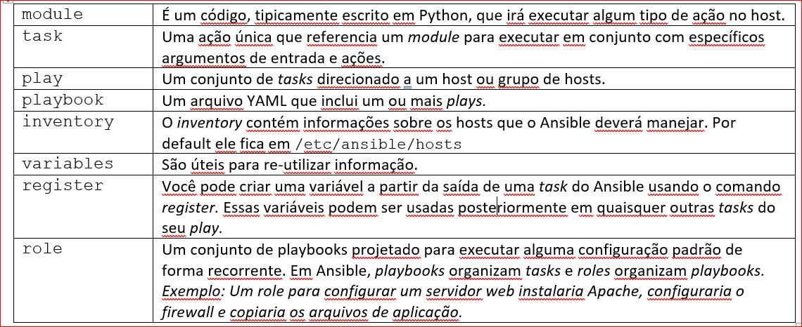
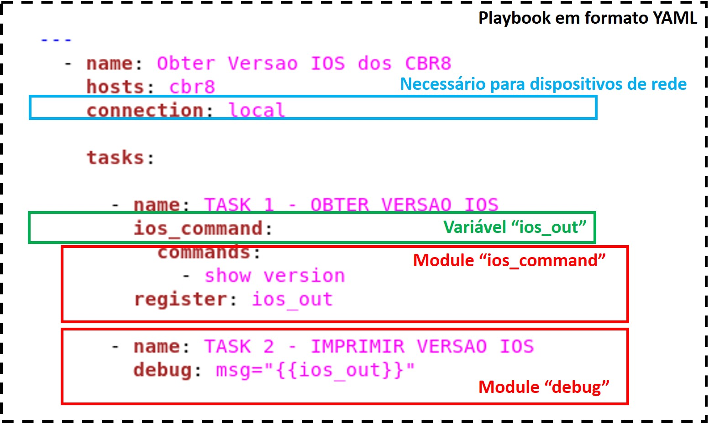
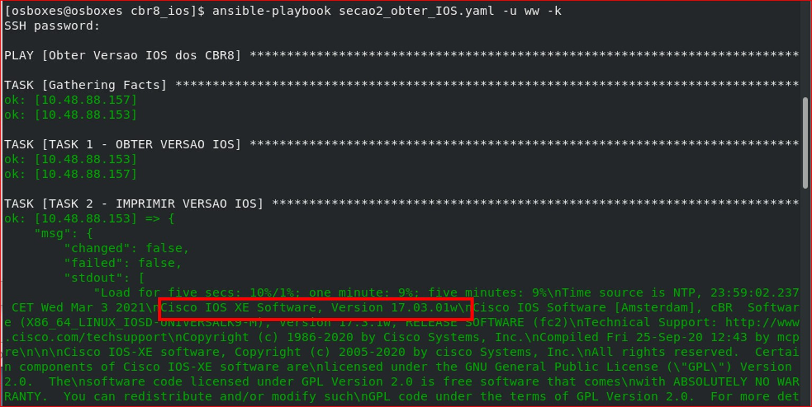
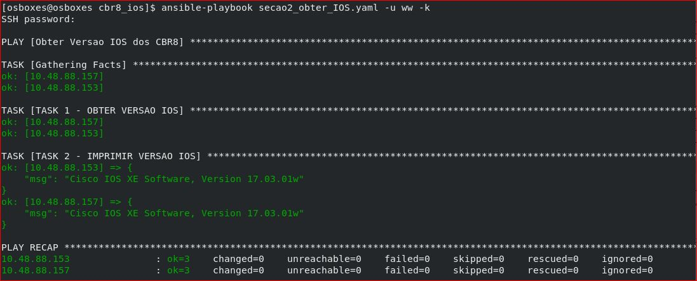

DEVNET – Conceitos e exemplos ilustrados com a plataforma Cisco IOS-XE (CBR8)
======

Seção 2 - Gerenciamento de Configuração
=================

A configuração de um único servidor é uma tarefa relativamente simples, mas quando vários servidores têm de ser configurados com versões de software e características iguais, a configuração manual pode demandar muito tempo. Também durante a operação, você sempre terá de atualizar, modificar, copiar arquivos, entre outras tarefas, que necessitarão tanto mais tempo quanto maior for o número de servidores/dispositivos.

Assim, várias ferramentas de configuração foram desenvolvidas para otimizar essas implementações, entre as quais se destacam Puppet, Saltstack, Chef e Ansible. Nesta seção iremos ver o funcionamento básico do Ansible, com foco no gerenciamento da configuração de equipamentos de rede, para a qual o Ansible se destaca principalmente pelo fato do processamento ser todo feito na estação de controle, sem a necessidade de nenhum agente/cliente instalado nos dispositivos remotos.


Ansible
-------

O termo Ansible vem do livro "Rocannon's World", que foi escrito em 1966 por Ursula K. Le Guin e se referia a um sistema de comunicação fictício mais rápido que a velocidade da luz.

Trata-se de um software para aprovisionamento e de gerenciamento de configuração, que pode tanto ser utilizado em servidores quanto em equipamentos de rede. O Ansible te permite enviar comandos a vários dispositivos ao mesmo tempo, permitindo automatizar tarefas e orquestrar processos. Além de reduzir a probabilidade de erro humano, isso te permite obter maior consistência na configuração dos dispositivos.

Objetivo desta seção
--------------------
Entender os princípios básicos do Ansible, sua aplicação principalmente para controle de equipamentos de rede e familiarizar-se com uma configuração simples e que funcione.

Como funciona?
--------------
O Ansible requer um servidor de controle, que se conecta tipicamente via SSH a dispositivos remotos, enviando pequenos programas, chamados _Ansible modules_ a esses dispositivos, que se "auto-destroem" após a execução. No caso do gerenciamento de dispositivos de rede, os _modules_ de rede são executados no próprio servidor de controle, uma vez que muitos dos dispostivos de rede não conseguem rodar Python para executar esses _modules_.

A solução Ansible inclui um ou mais dos items mostrados na figura. São executadas _tasks_ para um _inventory_ com a utilização de _modules_, que por sua vez usam ou escrevem em _variables_. Isso pode ser descrito por _playbooks_, que por sua vez podem ser organizados em _roles_.

Uma breve descrição de cada um dessses elementos é mostrada na tabela abaixo:



Vamos ilustrar com um exemplo simples: suponha que tenhamos que consultar cada CBR8 (que usa o sistema operacional IOS-XE) da nossa rede para verificar sua versão de software. Se você não tiver acesso a um CBR8 você pode usar uma das Cisco _sandboxes_ para IOS-XE, como por exemplo a "IOS XE on CSR Latest Code", que você pode encontrar em: https://devnetsandbox.cisco.com/RM/Topology 

Para isso lembrar que é preciso ter ssh configurado no CBR8. Detalhes de como fazer essa configuração podem ser obtidos em: https://www.cisco.com/c/en/us/td/docs/switches/lan/catalyst2960x/software/15-2_2_e/consolidated_guide/configuration_guide/b_1522e_consolidated_2960x_cg/b_consolidated_152ex_2960-X_cg_chapter_0100110.pdf

O arquivo "/etc/ansible/hosts" é o inventário de dispositivos (_inventory_) e é onde temos de agregar os endereços IP dos dispositivos. No arquivo original podem ser encontrados vários detalhes sobre a configuração desse arquivo, mas é suficiente que o arquivo seja bem simples, com um nome de grupo entre colchetes e os endereços IP:
```
[cbr8]
10.48.88.153
10.48.88.157
```

O _playbook_ da figura abaixo irá estabelecer uma conexão ssh com os dispositivos presentes no _inventory_ (/etc/ansible/hosts). A primeira _task_ utilizará o _module_ "ios_command" para enviar o comando "show version" a esses dispositivos; essa mesma _task_ fará com que a saída desse comando seja guardada numa variável chamada "ios_out" através da utilização do _module_ "register". A segunda _task_ imprime o resultado do comando na tela por meio do _module_ "debug".



O formato em que são escritos os _playbooks_ é chamado YAML (Yet Another Markup Language), cuja sintaxe exige que se siga uma identação correta. Algumas características desse formato:

- É um formato legível de serialização de dados
- Sempre começa com 3 hífens (---)
- Entre as diferentes _tags_ podemos citar:

**Name**: especifica o nome do _playbook_ (descreve sua funcionalidade).

**Hosts**: é uma tag mandatória que especifica a lista ou grupo de hosts contra o qual será rodado a _task_. 

**Vars**: permite definir variáveis que podem ser usadas no _playbook_.

**Tasks**: todo _playbook_ deve conter _tasks_ ou uma lista de _tasks_ para executar. _Tasks_ contêm um nome e uma lista de ações a serem executadas. Cada _task_ é ligada internamente a um pedaço de código que é chamado _module_. Um _module_ é um código que precisa de argumentos para ser executado.

Antes de executar o _playbook_ é importante garantir que a chave pública de encriptação usada no SSH seja copiada para o PC onde o Ansible estará sendo rodado. Para isso pode-se utilizar o seguinte comando:

`sudo ssh-keyscan -f list_of_hosts >> ~/.ssh/known_hosts
`

O **ssh-keyscan** é uma ferramenta para obter as chaves públicas de SSH de vários hosts. Se apontarmos o comando para nosso arquivo "/etc/ansible/hosts" evitamos ter de entrar manualmente em cada dispositivo. 

Para rodar o _playbook_ usamos o comando "ansible-playbook":

```
$ ansible-playbook secao2_obter_IOS.yaml -u ww -k
```

A opção -u indica que utilizaremos o usuário "ww" para conexão aos dispositivos, e a opção -k faz com que seja pedida a password. Os dados de usuário podem, opcionalmente, ser incorporados ao arquivo YAML. Isso tem a vantagem de não ser necessário digitar a password toda vez que rodar o playbook e a desvantagem de necessitar um cuidado adicional com a segurança.

O resultado aparece da forma mostrada na figura abaixo. Pode-se observar a existência de um _Play_ que contém 3 _Tasks_. Você pode estar se perguntando por que 3 _tasks_ se apenas existiam 2 no _playbook_:

- TASK 1 - OBTER VERSAO IOS
- TASK 2 - IMPRIMIR VERSAO IOS

Ocorre que há uma _task_ que é rodada por default (TASK [Gathering Facts]) a não ser que você a desabilite com o comando "gather_facts: no". Essa task serve para obter informações gerais sobre o dispositivo (incluindo versão de software!). 



A variável "ios_out" contém a saída do comando "show version" e é formatado como um dicionário Python:

````
ios_out = {
    "changed": False,
    "failed": False,
    "stdout": ["x\n y\n z\n"],
    "stdout_lines": [["x","y","z"]]
}
````
Note que os dois primeiros valores do dicionário (representados pelas _keys_ "changed" e "failed") são do tipo booleanos (True / False) e os outros são listas. A primeira lista ("stdout") contém apenas 1 elemento (uma string longa com divisões usando caracteres de nova linha "\n"). A segunda list ("stdout_lines") contém a mesma informação, só que dividindo cada linha em elementos de uma lista.
 
Assim, posso acessar linhas específicas da saída "show version" usando a _key_ "stdout_lines" e o índice da linha (lembrar que o índice da primeira linha é zero). Como existe uma lista dentro de outra lista, o primeiro "[0]" refere-se a toda a lista e o segundo "[0]" refere-se ao primeiro elemento ("x").
```
ios_out["stdout_lines"][0][0]] = x
```
Dessa forma, se eu mudar a última linha do meu _playbook_ para:
````
debug: msg="{{ios_out["stdout_lines"][0][2]}}"
````
Você poderá ter de ajustar os índices de acordo com a saída proporcionada por cada tipo de dispositivo. No nosso caso a saída ficará da forma abaixo; veja que conseguimos filtrar apenas a informação desejada (versão do IOS):



Referências
-----------
- https://www.liquidweb.com/kb/puppet-salt-chef-ansible-a-comparison/
- https://www.ansible.com/overview/how-ansible-works  
- https://en.wikipedia.org/wiki/Ansible_(software)   
- https://docs.ansible.com/core.html
- https://docs.ansible.com/ansible/2.9/modules/ios_command_module.html
- https://devnetsandbox.cisco.com/RM/Topology
- http://infonetwork.ir/wp-content/uploads/2019/06/Ansible-Up-and-Running.pdf
- Course: Implementing Automation for Cisco Service Provider Solutions (Cisco Digital Learning)