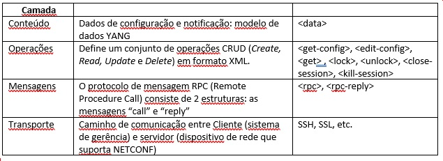

DEVNET – Conceitos e exemplos ilustrados com a plataforma Cisco IOS-XE (CBR8)
======

Seção 3 - Programabilidade de rede com NETCONF
=================

Desafio do gerenciamento de redes
--------------------
Um ambiente de Service Provider pode incluir inúmeros dispositivos, de vários tipos e de vários fabricantes. Scripts de linha de comando são comumente utilizados para configuração desses dispositivos, mas eles têm a desvantagem de serem muitas vezes trabalhosos para se manter e, algumas vezes, não são confiáveis. Para monitoração e identificação de falhas é comum o uso de sistemas de gerência que usam protocolo SNMP. Embora esse protocolo tenha sido inicialmente pensado também para manipular a configuração de equipamentos, devido a limitações práticas ele acabou se tornando viável apenas para monitoração.

Objetivo desta seção
--------------------
Estabelecer uma sessão Netconf com um equipamento Cisco IOS-XE de forma manual e então utilizar a biblioteca _ncclient_ do Python para fazer a mesma coisa. Depois mostrar uma aplicação da Cisco chamada Yang Suite para interagir via Netconf com o mesmo equipamento, além de ilustrar a relação entre o modelo de dados Yang e o protocolo de transporte Netconf. 

NETCONF
--------------------
O desenvolvimento do protocolo Netconf (o nome vem de NETwork CONFiguration) começou no IETF (Internet Engineering Tasking Force) para endereçar as dificuldades existentes no gerenciamento de configurações por meio de scripts e as limitações apresentadas pelo protocolo SNMP. Foi publicado em 2006 na RFC4741 (versão 1.0) e revisado em 2011 através da RFC6241 (versão 1.1).

O protocolo de gerenciamento Netconf proporciona os mecanismos para editar os dados de configuração e obter os dados operacionais dos dispositivos de rede. Os dados de configuração representam a forma pela qual as interfaces, protocolos de roteamento e outras funções de rede estão aprovisionadas. Alguns exemplos de dados operacionais são as estatísticas das interfaces, utilização de memória, erros, etc.

O Netconf é o protocolo que realmente se comunica com os dispositivos de rede para visualizar ou modificar a configuração ou para obter informações de estado operacional, e faz isso através de RPCs, ou Remote Procedure Calls. Para especificar o que se deseja fazer na operação, o Netconf lança mão de um modelos de dados chamado YANG (Yet Another Next Generation) [3], que descreve dados de configuração e operacionais, organizando-os em módulos e de forma hierárquica. Outro exemplo de modelo de dados são as MIBs usadas no protocolo SNMP. Você pode então ter módulos YANG que definem por exemplo uma interface, os alarmes de um dispositivo, estado de sensores, estado de protocolos de roteamento etc. 

Assim, o protocolo Netconf pode ser dividido nas seguintes camadas:


 
Para estabelecer uma sessão Netconf com o CBR8 é necessário que a versão do dispositivo suporte Netconf (usamos no nosso exemplo a versão 16.12.1z). Você precisará também de um usuário com privilégio nível 15 e então deverá usar o seguinte comando no CBR8 [4]:

```
CBR8# configure terminal 
CBR8(config)# netconf-yang
``` 

Os comandos abaixo podem ser usados para verificação da configuração NETCONF no lado do CBR8:

    show netconf-yang datastores
    show netconf-yang sessions
    show netconf-yang sessions detail
    show netconf-yang statistics
    show platform software yang-management process
    show platform software yang-management process state

O estabelecimento da conexão ocorre da forma que ilustrada a seguir [1]:


1- O Cliente se conecta ao subsistema SSH Netconf, por exemplo através do seguinte comando a partir de uma plataforma linux: 
```
ssh ww@10.48.88.153 -p 830 -s netconf
```
2- O Servidor (dispositivo de rede) responde com um Hello que inclui as _capabilities_ NETCONF suportadas suportadas pelo dispositivo. Essas _capabilities_ são exatamente os modelos YANG suportados pelo dispositivo. Repare especificamente no modelo "Cisco-IOS-XE-docsis-oper", pois esse é o modelo que usaremos no nosso exemplo. Repare também que a comunicação termina sempre com esta série de caracteres: "]]>]]>"

```
<?xml version="1.0" encoding="UTF-8"?>
<hello xmlns="urn:ietf:params:xml:ns:netconf:base:1.0">
<capabilities>
<capability>urn:ietf:params:netconf:base:1.0</capability>
<capability>urn:ietf:params:netconf:base:1.1</capability>
<capability>urn:ietf:params:netconf:capability:candidate:1.0</capability>
. . .
<capability>http://cisco.com/ns/yang/Cisco-IOS-XE-docsis-oper?module=Cisco-IOS-XE-docsis-oper&amp;revision=2019-03-01</capability>
. . .
<capability>
        urn:ietf:params:netconf:capability:notification:1.1
      </capability>
</capabilities>
<session-id>71</session-id>
</hello>
]]>]]>
```


3- O Cliente agora irá responder com as _capabilities_ suportadas por ele próprio. Repare que a comunicação também termina com a série de caracteres: "]]>]]>":

```
<hello xmlns="urn:ietf:params:xml:ns:netconf:base:1.0">
<capabilities>
    <capability>urn:ietf:params:netconf:base:1.0</capability>
</capabilities>
</hello>
]]>]]>
```

Observação: Nosso modelo de dados YANG pode ser observado de forma mais legível usando uma ferramenta chamada "pyang":
```
(py3-venv) [osboxes@osboxes 16121]$ pyang -f tree Cisco-IOS-XE-docsis-oper.yang
module: Cisco-IOS-XE-docsis-oper
  +--ro docsis-oper-data
     +--ro cm-summary-total!
     |  +--ro total?                  uint32
     |  +--ro registered?             uint32
     |  +--ro operational?            uint32
     |  +--ro unregistered?           uint32
     |  +--ro offline?                uint32
     |  +--ro wideband?               uint32
     |  +--ro initrc?                 uint32
     |  +--ro initd?                  uint32
     |  +--ro initio?                 uint32
     |  +--ro inito?                  uint32
     |  +--ro cm-if-summary-totals* [interface]
     |     +--ro interface       string
...
     +--ro cable-modem* [mac-address]
     |  +--ro mac-address       yang:mac-address
     |  +--ro ipv4-addr?        inet:ipv4-address
... 
(saída omitida para maior clareza)
... 
```

4- Vamos agora fazer nosso Cliente enviar uma solicitação "get" para obter as informações correspondentes ao comando "show cable modem summary total", que está disponível no modelo YANG "Cisco-IOS-XE-docsis-oper", como acabamos de ver acima.

Note na figura abaixo as diversas camadas do protocolo Netconf. Na camada de "Mensagem" (em preto) perceba que é especificado message-id="101" após o namespace. Esse mesmo ID será utilizado quando o dispositivo responder a esta mensagem.
 
 Na próxima camada em azul é onde especificamos o tipo de operação. Além disso, como esse modelo de dados contém grande quantidade de informação, e só estamos interessados no "show cable modem summary total", vamos agregar um filtro ao nosso comando "get". Veja na figura a tag <filter> foi agregada para especificar a parte do modelo de dados que se quer obter.
 
 Finalmente, na parte em verde, estão especificados os dados, de acordo com o modelo YANG "Cisco-IOS-XE-docsis-oper".


5- O Servidor envia resposta com as informações solicitadas. Note que o namespace contém o campo message-id="101".  

```
<?xml version="1.0" encoding="UTF-8"?>
<rpc-reply xmlns="urn:ietf:params:xml:ns:netconf:base:1.0" message-id="101"><data><docsis-oper-data xmlns="http://cisco.com/ns/yang/Cisco-IOS-XE-docsis-oper"><cm-summary-total><total>6</total><registered>4</registered><operational>4</operational><unregistered>2</unregistered><offline>0</offline><wideband>4</wideband><initrc>0</initrc><initd>0</initd><initio>0</initio><inito>2</inito><cm-if-summary-totals><interface>C6/0/0</interface><total>4</total><registered>4</registered><operational>4</operational><unregistered>0</unregistered><offline>0</offline><wideband>4</wideband><initrc>0</initrc><initd>0</initd><initio>0</initio><inito>0</inito></cm-if-summary-totals><cm-if-summary-totals><interface>C6/0/10</interface><total>2</total><registered>0</registered><operational>0</operational><unregistered>2</unregistered><offline>0</offline><wideband>0</wideband><initrc>0</initrc><initd>0</initd><initio>0</initio><inito>2</inito></cm-if-summary-totals></cm-summary-total></docsis-oper-data></data></rpc-reply>]]>]]>
```

É complicado visualizar tamanha quantidade de informação, mesmo filtrando apenas o que necessitamos. Você pode usar um visualizador de XML online (exemplo https://codebeautify.org/xmlviewer#copy) e ter o seguinte resultado:

```
<?xml version="1.0" encoding="UTF-8"?>
<rpc-reply
	xmlns="urn:ietf:params:xml:ns:netconf:base:1.0" message-id="101">
	<data>
		<docsis-oper-data
			xmlns="http://cisco.com/ns/yang/Cisco-IOS-XE-docsis-oper">
			<cm-summary-total>
				<total>6</total>
				<registered>4</registered>
				<operational>4</operational>
				<unregistered>2</unregistered>
				<offline>0</offline>
				<wideband>4</wideband>
				<initrc>0</initrc>
				<initd>0</initd>
				<initio>0</initio>
				<inito>2</inito>
				<cm-if-summary-totals>
					<interface>C6/0/0</interface>
					<total>4</total>
					<registered>4</registered>
					<operational>4</operational>
					<unregistered>0</unregistered>
					<offline>0</offline>
					<wideband>4</wideband>
					<initrc>0</initrc>
					<initd>0</initd>
					<initio>0</initio>
					<inito>0</inito>
				</cm-if-summary-totals>
				<cm-if-summary-totals>
					<interface>C6/0/10</interface>
					<total>2</total>
					<registered>0</registered>
					<operational>0</operational>
					<unregistered>2</unregistered>
					<offline>0</offline>
					<wideband>0</wideband>
					<initrc>0</initrc>
					<initd>0</initd>
					<initio>0</initio>
					<inito>2</inito>
				</cm-if-summary-totals>
			</cm-summary-total>
		</docsis-oper-data>
	</data>
</rpc-reply>
``` 

Não é prático, prtanto, estabelecer esse tipo de comunicação Netconf de forma manual. Veremos a seguir outras formas de manejar essa comunicação.

ncclient
---
O ncclient é uma biblioteca Python que facilita o uso do protocolo Netconf. A instalação pode ser feita via pip:
```
pip install ncclient
```
Vamos agora fazer o mesmo que fizemos manualmente acima, obter as informações correspondentes ao "show cable modem summary total", só que agora usando Python e a biblioteca ncclient. Um exemplo é mostrado abaixo (_host_, _user_ e _password_ devem ser substituídos pelos dados do seu equipamento):
```
#!/usr/bin/env python

from ncclient import manager
import xmltodict
import xml.dom.minidom

CBR8 = {
    "host": "10.48.88.153",
    "username": "user",
    "password": "password",
    "netconf_port": 830,
    "restconf_port": 9443,
    "ssh_port": 22
}

# Criando um filtro XML para a operacao NETCONF desejada
netconf_filter = """
      <docsis-oper-data xmlns="http://cisco.com/ns/yang/Cisco-IOS-XE-docsis-oper">
        <cm-summary-total/>
      </docsis-oper-data>
"""


print("Opening NETCONF Connection to {}".format(CBR8["host"]))

# Abrindo uma conexao com o dispositivo de rede usando ncclient
with manager.connect(
        host=CBR8["host"],
        port=CBR8["netconf_port"],
        username=CBR8["username"],
        password=CBR8["password"],
        hostkey_verify=False
) as m:
    print("Sending a <get> operation to the device.\n")

    # Fazendo um NETCONF <get> usando o filtro
    netconf_reply = m.get(('subtree', netconf_filter))

print(xml.dom.minidom.parseString(netconf_reply.xml).toprettyxml())
```

O resultado depois de se executar o código acima, como esperado, é igual ao que se obtém com estabelecimento manual da comunicação:
```
<?xml version="1.0" ?>
<rpc-reply message-id="urn:uuid:9c415089-3fcf-4f95-bb3a-eb52490cc7de" xmlns="urn:ietf:params:xml:ns:netconf:base:1.0" xmlns:nc="urn:ietf:params:xml:ns:netconf:base:1.0">
	<data>
		<docsis-oper-data xmlns="http://cisco.com/ns/yang/Cisco-IOS-XE-docsis-oper">
			<cm-summary-total>
				<total>6</total>
				<registered>4</registered>
				<operational>4</operational>
				<unregistered>2</unregistered>
				<offline>0</offline>
				<wideband>4</wideband>
				<initrc>0</initrc>
				<initd>0</initd>
				<initio>1</initio>
				<inito>1</inito>
				<cm-if-summary-totals>
					<interface>C6/0/0</interface>
					<total>4</total>
					<registered>4</registered>
					<operational>4</operational>
					<unregistered>0</unregistered>
					<offline>0</offline>
					<wideband>4</wideband>
					<initrc>0</initrc>
					<initd>0</initd>
					<initio>0</initio>
					<inito>0</inito>
				</cm-if-summary-totals>
				<cm-if-summary-totals>
					<interface>C6/0/10</interface>
					<total>2</total>
					<registered>0</registered>
					<operational>0</operational>
					<unregistered>2</unregistered>
					<offline>0</offline>
					<wideband>0</wideband>
					<initrc>0</initrc>
					<initd>0</initd>
					<initio>1</initio>
					<inito>1</inito>
				</cm-if-summary-totals>
			</cm-summary-total>
		</docsis-oper-data>
	</data>
</rpc-reply>
```

YANG Suite
-------

YANG Suite é um conjunto de ferramentas que te permitem visualizar mais facilmente os modelos de dados YANG e respectiva comunicação com os dispositivos de rede. Trata-se de um ambiente de teste e validação para APIs YANG. 

Para instalar o cliente Docker no Centos 8:

I . CONFIGURAR O REPOSITÓRIO:
```
$ sudo dnf config-manager --add-repo=https://download.docker.com/linux/centos/docker-ce.repo
```

II . INSTALAR DOCKER ENGINE:

2.1) Instalar o cliente Docker. O Centos 8 não suporta Docker, porque contém suas próprias ferramentas _buildah_ e _podman_ (que pretendem ser compatíveis com imagens Docker existentes). Por isso tivemos que ajustar o procedimento normal de instalação do Docker para Centos [7] e usar os passos indicados abaixo: 
```
sudo yum install docker-ce docker-ce-cli containerd.io --allowerasing
```
Tivemos que agregar "--allowerasing" para que se ignorem alguns pacotes que causavam conflito:
```
Removed:
  buildah-1.16.7-4.module_el8.3.0+699+d61d9c41.x86_64
  cockpit-podman-27.1-3.module_el8.3.0+699+d61d9c41.noarch
  podman-2.2.1-7.module_el8.3.0+699+d61d9c41.x86_64
  podman-catatonit-2.2.1-7.module_el8.3.0+699+d61d9c41.x86_64
```

2.2) Iniciar e habilitar o serviço Docker para iniciar quando se faça boot: 
```
$ sudo systemctl enable --now docker
```

2.3) Verificar o estado do serviço Docker:
```
$ systemctl status  docker
Created symlink /etc/systemd/system/multi-user.target.wants/docker.service → /usr/lib/systemd/system/docker.service.
[osboxes@osboxes ~]$ systemctl status docker
● docker.service - Docker Application Container Engine
   Loaded: loaded (/usr/lib/systemd/system/docker.service; enabled; vendor preset: disabled)
   Active: active (running) since Tue 2021-04-13 11:53:50 EDT; 2s ago
```

2.3) Verificar se o cliente Docker está instalado corretamente executando a imagem "hello-world":
```
sudo docker run hello-world

Unable to find image 'hello-world:latest' locally
latest: Pulling from library/hello-world
b8dfde127a29: Pull complete 
Digest: sha256:308866a43596e83578c7dfa15e27a73011bdd402185a84c5cd7f32a88b501a24
Status: Downloaded newer image for hello-world:latest

Hello from Docker!
This message shows that your installation appears to be working correctly.
```

III. INSTALAR O DOCKER COMPOSE

O Docker Compose é uma ferramenta usada para definir e executar aplicações Docker multi-container. Seguimos o processo indicado em [8] para fazer a instalação:

3.1) Caso ainda não esteja instalado, instalar _curl_:
```
sudo yum -y install curl
```

3.2) Fazer o download da última versão do Docker Compose. Pode-se usar um diretório temporário (/home/osboxes/tmp) para fazer o download:
```
[osboxes@osboxes ~]$ mkdir tmp
[osboxes@osboxes ~]$ cd tmp

curl -s https://api.github.com/repos/docker/compose/releases/latest \
  | grep browser_download_url \
  | grep docker-compose-Linux-x86_64 \
  | cut -d '"' -f 4 \
  | wget -qi -

[osboxes@osboxes tmp]$ ls -l
total 12456
-rw-rw-r--. 1 osboxes osboxes 12750072 Apr  6 17:06 docker-compose-Linux-x86_64
-rw-rw-r--. 1 osboxes osboxes       94 Apr  6 17:07 docker-compose-Linux-x86_64.sha256
```

3.3) Agora modifique o arquivo binário docker-compose-Linux-x86_64 para que seja executável:
```
[osboxes@osboxes tmp]$ chmod +x docker-compose-Linux-x86_64
[osboxes@osboxes tmp]$ ls -l
total 12456
-rwxrwxr-x. 1 osboxes osboxes 12750072 Apr  6 17:06 docker-compose-Linux-x86_64
-rw-rw-r--. 1 osboxes osboxes       94 Apr  6 17:07 docker-compose-Linux-x86_64.sha256
```

3.4) Mover o binário para o seu PATH:
```
sudo mv docker-compose-Linux-x86_64 /usr/local/bin/docker-compose
```

3.5) Confirme a versão do Docker Compose:
```
[osboxes@osboxes tmp]$ docker-compose version
docker-compose version 1.29.0, build 07737305
docker-py version: 5.0.0
CPython version: 3.7.10
OpenSSL version: OpenSSL 1.1.0l  10 Sep 2019
```

3.6) Adicione o usuário ao grupo "docker":
```
sudo usermod -aG docker $USER
newgrp docker
```

IV. Agora que o Docker está instalado podemos clonar o diretório do github:
```
$ git clone https://github.com/CiscoDevNet/yangsuite
```
Agora execute os seguintes comandos :
```
$ cd yangsuite/docker
$ ./gen_test_certs.sh
################################################################
## Generating self-signed certificates...                     ##
##                                                            ##
## WARNING: Obtain certificates from a trusted authority!     ##
##                                                            ##
## NOTE: Some browsers may still reject these certificates!!  ##
################################################################
 
Generating a RSA private key
..+++++
...........................................+++++
writing new private key to 'nginx/nginx-self-signed.key'
-----
```
E inicie o container:
```
$ docker-compose up
```
O processo deve demorar pelo menos uns 15 minutos. Mas nas próximas vezes que você iniciar o Yangsuite será rápida a inicialização. Após a instalação, abra um browser, navegue até http://localhost e inicie a sessão com usuário "admin" e senha "superuser".


Referências
-----------

[1] Cisco Training: Implementing Automation for Cisco Service Provider Solutions
https://ondemandelearning.cisco.com/cisco-cte-lite/spaui10/sections/1/pages/2

[2] Programmability Configuration Guide, Cisco IOS XE Fuji 16.12.x
https://www.cisco.com/c/en/us/td/docs/ios-xml/ios/prog/configuration/1612/b_1612_programmability_cg/configuring_yang_datamodel.html

[3] YANG (Yet Another Next Generation) https://tools.ietf.org/html/rfc6020

[4] Programmability Configuration Guide, Cisco IOS XE Gibraltar 16.12.x
https://www.cisco.com/c/en/us/td/docs/ios-xml/ios/prog/configuration/1612/b_1612_programmability_cg/configuring_yang_datamodel.html

[5] https://pypi.org/project/ncclient/

[6] https://developer.cisco.com/docs/yangsuite/

[7] https://docs.docker.com/engine/install/centos/

[8] https://computingforgeeks.com/how-to-install-latest-docker-compose-on-linux/

Outras referências:

- https://www.youtube.com/watch?v=04roRre1LnQ&ab_channel=NetworkEvolution
- https://www.youtube.com/watch?v=1r_XXA7QX8M
- https://github.com/brybyrne/ciscolive2018-brybyrne
- https://cisco.sharepoint.com/sites/CXRC_CustomerSuccess/SitePages/Engineer-Community-All-Hands-%26-Tech-Speaker-Series.aspx
- https://tools.ietf.org/html/rfc6643